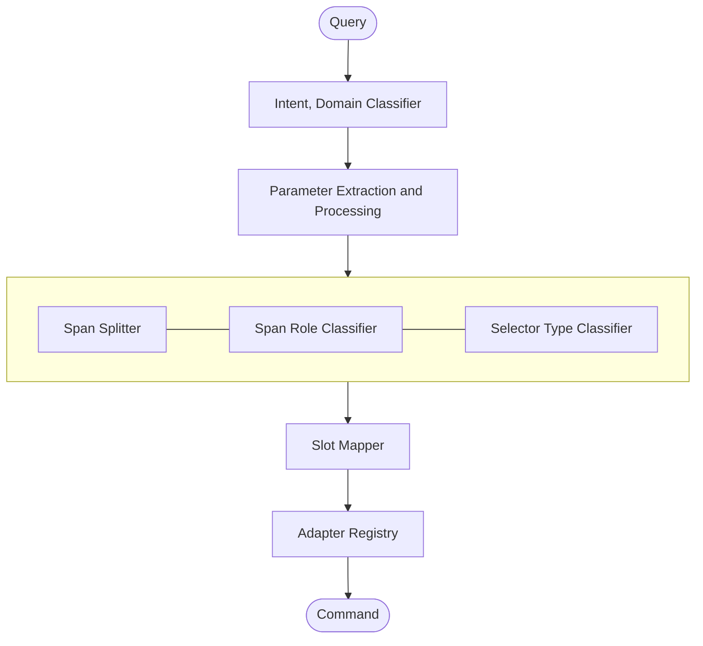

# coggle

A lightweight, fully offline CLI tool for file processing and conversions, format-specific operations, as well as easy bulk file management using tiny NLP pipelines. No tokens, no cloud nonsense.


## The Problem

Routine file tasks such as converting image formats, trimming videos, splitting PDFs typically means one of three things:

- **Uploading to a website**: slow, and a privacy risk if the files are sensitive.
- **Using a single-purpose app**: fast, but locked to one format or one task.
- **Prompting a cloud LLM**: flexible, but requires internet, adds latency, and depends on third-party availability.

Coggle is the fourth option: a local, natural-language interface that maps plain commands to the right tool for the job.


## Capabilities

### File Management
Search and select files based on various parameters; move, copy, rename, delete, create hard links and symlinks.

### File Conversion
Convert between formats across image, video, audio, and document types.

### Format-Specific Processing

| Domain   | Operations |
|----------|------------|
| Video    | trim, crop, transcode, downscale, upscale, extract audio (via ffmpeg) |
| Image    | crop, resize, filter, format conversion (via ImageMagick) |
| Document | format conversion, page operations (via pandoc, others) |


## Architecture

Coggle is built around two core ideas: a layered NLP pipeline that extracts meaning from a query, and an adapter system that translates that meaning into executable commands.

### The NLP Pipeline

Rather than using brittle regex or compute-heavy transformers, Coggle uses a staged pipeline where each layer has a narrow and specifc responsibility.




**1. Intent Classifier**

Runs first on the raw query using keyword and synonym matching with word boundary regex (processor subject to change). Identifies the operation the user wants to perform (e.g. `move`, `delete`, `trim`).

- Each intent owns its own keyword list.
- Keyword collisions between intents are resolved via explicit `overrides` (e.g. `symlink` overrides `create`, so `"make a symlink"` resolves to `symlink` rather than a compound query).
- Queries matching more than one intent after override resolution are rejected as compound queries.
- unrecognized or ambiguous queries are rejected with a clear error rather than guessed at.

**2. Span Splitter**

Uses spaCy's `en_core_web_sm` model to segment the query into meaningful spans based on POS tags and (later) dependency trees. Each span represents a discrete chunk of information.

```
"move all files modified before 2022 to archive folder"
  →  [['all', 'files'], ['modified', 'before', '2022'], ['to', 'archive', 'folder']]
```

**3. Span Role Classifier**

Classifies each span into a semantic role — `selector`, `destination`, `source`, etc. This layer is domain-agnostic; the same roles are meaningful across filesystem, video, and image operations. Prepositions within spans (`to`, `from`, `before`, `after`) are treated as strong signals for role assignment rather than noise.

**4. Selector Type Classifier**

Further categorizes `selector` spans by their type — `glob`, `time`, `size`, and so on. This layer is domain-aware; selector types vary across adapters (e.g. `timestamp` and `resolution` are ffmpeg-native types that don't exist in the filesystem domain).

**5. Slot Mapper**

Matches typed and classified spans to the specific parameter slots defined by the matched capability in the adapter. Uses the capability and slot descriptions to resolve spans to slots with a confidence score. When multiple adapter capabilities are candidates for the same intent, the one with the highest confidence match wins.


### The Adapter System

Adapters are how Coggle knows what tools exist and what they can do. Each adapter wraps a single external tool and declares its capabilities in a self-describing way that the NLP pipeline can query at runtime.

For further implementation details look at the [Adapters wiki page](https://github.com/sortedcord/coggle/wiki/Adapters)

```
Adapter (e.g. ffmpeg)
  └── Domain (e.g. video)
  │     └── Capability (e.g. trim)
  │           ├── triggers:     ["trim", "cut", "clip"]
  │           ├── description:  "cut or shorten a video between two points in time"
  │           ├── destructive:  false
  │           ├── command:      { base = "ffmpeg", execution = "loop", ... }
  │           └── slots:
  │                 ├── input       (filepath,   TARGET)      — "the source video file"
  │                 ├── output      (filepath,   DESTINATION) — "the output file path"
  │                 ├── start_time  (timestamp,  CONSTRAINT)  — "where to begin the cut"
  │                 ├── end_time    (timestamp,  CONSTRAINT)  — "where to end the cut"
  │                 └── codec       (enum,       ARGUMENT)    — "video codec to encode with"
  └── Domain (e.g. audio)
        └── Capability (e.g. extract)
              └── ...
```

**Adapter** — wraps a single external tool. Can declare capabilities across multiple domains.

**Domain** — groups capabilities by the type of file they operate on. Defined by file extensions, MIME types, or a wildcard `match = "any"` for type-agnostic operations like filesystem management. Acts as a filter on the candidate capability set, not a hard selector.

**Capability** — a single operation the tool can perform. Maps to exactly one intent via its `triggers` list and defines the full parameter signature required to construct the command. Capabilities with `destructive = true` require a dry-run confirmation before execution.

**Slot** — a single parameter of a capability. Each slot declares a span `category` (`TARGET`, `DESTINATION`, `CONSTRAINT`, `ARGUMENT`), a `type` (`filepath`, `quantity`, `timestamp`, `enum`, ...), and a natural language `desc` that the slot mapper uses for confidence scoring. Slots with `cardinality = "many"` declare an `expansion` strategy (`inline` or `loop`) that controls how multiple values are passed to the tool.

**Registry** — at runtime, adapters register themselves with the central registry. The intent classifier queries the registry for known triggers, and the slot mapper queries it to retrieve candidate capabilities for a given intent.

### Design Decisions

- Bulk by default: If no specific filename is given, operations apply to all matching files. Destructive actions (`delete`, `move`, `truncate`) require a dry run confirmation step before executing.
- Confidence based resolution: When multiple capabilities match the same intent, the slot mapper scores each against the extracted spans and picks the highest-confidence match. Adapters do not declare priority over each other.
- One intent per capability: Each capability maps to exactly one intent. This keeps capability definitions unambiguous and collision resolution straightforward.


## Design Constraints

- **Fully offline**: no network calls at any point
- **No GPU required**: runs on edge compute and low-resource machines
- **Small model footprint**: NLP pipeline uses `en_core_web_sm` via spaCy (~12MB) [May use MiniLM based SLM in the future]
- Agentic-friendly: can be used as a subprocess tool by other agents for fast, local file operations


## Development Setup

Install all dependencies using [uv](https://github.com/astral-sh/uv):

```sh
uv install
```

Load the spaCy language model:

```sh
uv run python -m spacy download en_core_web_sm
```

Run tests:

```sh
uv run python -m pytest
```


## Current Status

Coggle is in active development. The filesystem vertical is the current proof-of-concept, with the intent classifier prototype complete covering `list`, `move`, `copy`, `delete`, `rename`, `create`, `hardlink`, `symlink`, and `truncate`. The span splitter is implemented using spaCy POS tags. Span role classification, selector typing, slot mapping, and the adapter registry are in progress.

Format specific verticals (video, image, document) and the full adapter system are scoped for future development. The execution layer currently targets single-command mapping only.